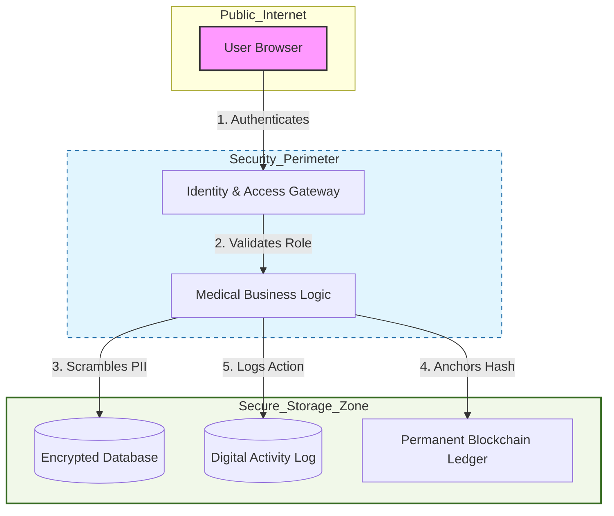

# LifeX Security Threat Model Document

This document serves as the official security blueprint for the LifeX platform, outlining how we identify, prioritize, and neutralize potential security risks.

---

## 1. System Overview

### Purpose
LifeX is a high-security medical records platform designed to give patients complete ownership of their health data. It uses modern technology to ensure that medical records are unchangeable and private information is kept secret.

### Users
*   **Patients:** View their own medical history and manage their profile.
*   **Doctors & Nurses:** Upload medical results and manage patient schedules.
*   **Medical Receptionists:** Enroll new patients and manage appointments.
*   **Administrators:** Manage system accounts and oversee the digital security logs.

### Main Modules
*   **Identity System:** Handles logins, password security, and account lockouts.
*   **Medical Record Vault:** Manages the uploading, scrambling, and viewing of health files.
*   **Blockchain Ledger:** Provides permanent proof that medical records have not been tampered with.
*   **Audit Logger:** A silent watcher that records every important action for safety reviews.

---

## 2. System Diagram (Data Flow & Trust Boundaries)

---

## 3. Threat Identification (STRIDE)

We categorize potential threats based on the component they target:

| Platform Component | STRIDE Category | Specific Threat Description |
| :--- | :--- | :--- |
| **Identity System** | **Spoofing** | An attacker attempts to guess a password using a computer program (Brute Force). |
| **Medical Records** | **Tampering** | A malicious user tries to change a diagnosis or lab result after it is saved. |
| **Audit Logger** | **Repudiation** | A staff member performs an unauthorized action and tries to delete the log entry. |
| **Database** | **Info Disclosure** | An attacker steals the storage files and reads private patient phone numbers/IDs. |
| **Web Gateway** | **Denial of Service** | Someone tries to crash the site by uploading a massive 1GB file. |
| **Access Control** | **Elevation of Privilege**| A patient attempts to use an admin link to see other people's records. |

---

## 4. Vulnerability Mapping

This section links the threats above to the specific parts of our architecture:

*   **Credential Guessing ↔ Authentication Gateway:** Without a proper lock, the front door is vulnerable to automated guessing.
*   **Data Integrity Failure ↔ Record Storage:** Storing records in a standard database alone is vulnerable to someone with database access changing the data.
*   **Privacy Leaks ↔ User Profiles:** Storing personal details in plain language makes them vulnerable if the physical server is ever compromised.
*   **Resource Exhaustion ↔ Upload System:** Allowing unlimited file sizes can lead to the server running out of space and crashing.

---

## 5. Mitigation Plan

Here are the detailed countermeasures we have implemented to solve the vulnerabilities identified:

### **Countermeasure 1: Advanced Front-Door Security**
*   **Action:** We use the world's most secure password scrambling method and an automated "count-and-block" system.
*   **Benefit:** Prevents computer-aided guessing and notifies the team of any attacks.

### **Countermeasure 2: Permanent Digital Anchoring**
*   **Action:** Every record is given a "fingerprint" stored on a permanent digital ledger that cannot be edited.
*   **Benefit:** Proves that a medical record is 100% original and has never been altered.

### **Countermeasure 3: Zero-Visibility Data Storage**
*   **Action:** All private details are turned into a secret code (scrambled) before they are even written to the disk.
*   **Benefit:** Even if a hacker stole the entire digital storage room, the patient information would be unreadable gibberish to them.

### **Countermeasure 4: The Silent Watchman (Auditing)**
*   **Action:** A system automatically records every successful and failed attempt to change or view information.
*   **Benefit:** Creates a permanent trail that cannot be hidden, ensuring everyone is accountable for their actions.

### **Countermeasure 5: Strict Boundary Enforcers**
*   **Action:** Every single request for information is double-checked against the user's official job title.
*   **Benefit:** Ensures that a user can never "drift" into a part of the platform they are not allowed to see.
